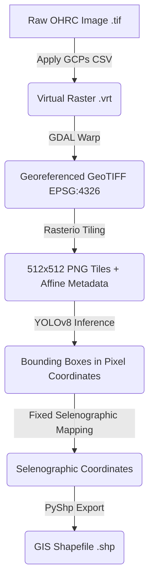

# Lunar Crater Detection & Selenographic Mapping Pipeline

An end-to-end machine learning and GIS (Geographic Information System) pipeline designed to detect lunar craters on high-resolution Orbiter High Resolution Camera (OHRC) imagery from India's **Chandrayaan-2** mission. 

By leveraging a **semi-supervised annotation strategy** and a fine-tuned **YOLOv8** model, this pipeline automatically detects craters, maps them back to absolute lunar degrees (selenographic coordinates), and exports them as GIS-ready shapefiles (`.shp`).

---

## 🌟 Relevance in the Era of Lunar Exploration (2026)

With NASA's **Artemis Program** preparing for crewed landings, ISRO's upcoming **Chandrayaan-4** sample return mission, and numerous robotic landers mapping the lunar surface, crater detection is more relevant than ever:
* **Autonomous Navigation**: Terrain Relative Navigation (TRN) depends on detecting landmarks like craters to land safely in real-time.
* **Hazard Avoidance**: Autonomous hazard mapping relies on accurate shapefiles to identify slopes and hazardous crater rims.
* **Geological Stratigraphy**: Craters are primary indicators of lunar surface age. Having a high-resolution, georeferenced database of craters is critical for planetary geologic mapping.
* **Unprecedented Resolution**: Chandrayaan-2's OHRC provides imagery at a spatial resolution of **25-32 cm/pixel**—surpassing NASA's LRO LROC-NAC (~50 cm/pixel), making it the highest resolution lunar surface dataset available today.

---

## 🛠️ Pipeline Architecture



1. **Georeferencing**: Converts raw lunar calibrated `.tif` imagery to geographic coordinates by applying thousands of Ground Control Points (GCPs) from the instrument geometry metadata using GDAL.
2. **Tiling**: Slices the large TIFF into `512x512` pixel png tiles for YOLOv8 processing, while tracking the spatial transformation matrix (using `rasterio`) to enable reverse mapping.
3. **Detection**: Runs YOLOv8 inference to locate craters on each tile.
4. **Selenographic Projection**: Converts pixel coordinates of detections back to absolute lunar degrees (fixing parameter-scrambling bugs in coordinate transformation).
5. **GIS Export**: Generates a standard shapefile (`.shp`, `.dbf`, `.shx`, `.prj`) for immediate visualization in QGIS or ArcGIS.

---

## 📈 Quantitative Results

Our semi-supervised YOLOv8 model was initially trained on 576 publicly annotated images, used to auto-label 3,600+ high-resolution OHRC tiles, and fine-tuned on the expanded dataset over 50 epochs.

* **Precision**: 88.9%
* **Recall**: 87.7%
* **mAP@0.5**: 94.99%

---

## 🔧 Installation & Setup

1. **Clone the repository**:
   ```bash
   git clone https://github.com/your-username/lunar-crater-detection.git
   cd lunar-crater-detection
   ```

2. **Install Python dependencies**:
   ```bash
   pip install -r requirements.txt
   ```

3. **Install System-level GDAL** (required for georeferencing):
   * **macOS**: `brew install gdal`
   * **Ubuntu**: `sudo apt-get install gdal-bin libgdal-dev`

---

## 🚀 Usage Guide

For a complete interactive walkthrough, see the [Demonstration Notebook](notebooks/demo_pipeline.ipynb).

### 1. Georeferencing
Warp the raw image using Ground Control Points:
```bash
python src/georeference.py
```

### 2. Tiling
Slice the image into 512x512 pngs:
```bash
python src/tiling.py
```

### 3. Inference
Perform crater detection on tiles:
```bash
python src/inference.py
```

### 4. Export Shapefile
Convert bounding boxes to georeferenced shapefiles:
```bash
python src/bbox_to_shp.py
```

---

## 🛠️ Fixed: QGIS Coordinate Scrambling Bug

Previously, the shapefile generated by `bbox_to_shp.py` was invisible in QGIS. 

* **The Issue**: The script stored transform coefficients in GDAL order `[c, a, b, f, d, e]` but instantiated them using the standard `Affine(a, b, c, d, e, f)` constructor, leading to scrambled coordinates (e.g. `6846`, `-25308`).
* **The Fix**: The pipeline has been updated to use `Affine.from_gdal(*transform_vals)`, ensuring the coordinates map correctly onto the lunar sphere (EPSG:4326/WGS84).
